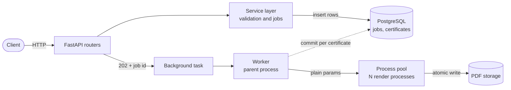

<div align="center">

# 🎓 Bulk Certificate Generator

**One API request in, hundreds of verifiable PDF certificates out.**


[Overview](#-overview) · [Architecture](#-architecture) · [Tech Stack](#-tech-stack) · [Getting Started](#-getting-started) · [API](#-api-reference) · [Design Decisions](#-design-decisions) · [Tests](#-testing)

</div>

---

## 📌 Overview

A backend service that accepts a **single request containing many recipients**, validates each one independently, and generates a PDF certificate for every valid recipient from a predefined template. Generation runs in the background, so the client gets an instant response and can poll for progress.

| Feature | Details |
|---|---|
| **Bulk input** | One `POST` accepts up to 1000 recipients (configurable) |
| **Failure isolation** | Invalid data or a render error on one certificate never stops the others |
| **Live progress** | Counters and `progress_percent` update after every certificate |
| **Retrieval** | Single PDF, paginated listing, or a ZIP of the whole job |
| **Verification** | Each certificate has a QR code and an HMAC-based verification code |
| **Resilience** | Idempotent submits, selective retry, crash recovery on restart |

---

## 🏗 Architecture



### Request lifecycle

1. **Submit** – The API validates the request, then each recipient. Invalid recipients are saved as `FAILED` (stage `VALIDATION`), valid ones as `PENDING`.
2. **Accept** – The API replies `202 Accepted` with the job id and a status URL, then schedules the worker.
3. **Render** – The parent process sends plain parameters to a process pool. Child processes render PDFs and never touch the database.
4. **Record** – As each result arrives, the parent updates that certificate and the job counters, and commits immediately.
5. **Finish** – The final job status is computed from the certificate rows.

### State model

| Entity | States |
|---|---|
| Job | `PENDING` → `PROCESSING` → `COMPLETED` / `COMPLETED_WITH_ERRORS` / `FAILED` |
| Certificate | `PENDING` → `PROCESSING` → `COMPLETED` / `FAILED` |
| Failure stage | `VALIDATION` (never retried) or `GENERATION` (retryable) |

---

## 🧰 Tech Stack

| Layer | Technology | Why |
|---|---|---|
| Language | Python 3.11+ | Required by the assignment, strong PDF and web ecosystem |
| Web framework | FastAPI, Pydantic v2 | Typed models and automatic OpenAPI docs at `/docs` |
| Database | PostgreSQL 16 | Relational store with constraints and transactions |
| ORM / migrations | SQLAlchemy 2.0, Alembic | Explicit models and versioned schema changes |
| PDF rendering | ReportLab | Pure Python, precise layout of a fixed A4 landscape template |
| QR codes | `qrcode` + Pillow | Scannable verification link on every certificate |
| Concurrency | `ProcessPoolExecutor` | CPU-bound rendering bypasses the GIL |
| Background hand-off | FastAPI `BackgroundTasks` | Instant `202` with no extra infrastructure |
| Testing | pytest, HTTPX `TestClient` | In-memory SQLite and temp storage, no external services |
| Packaging | Docker, Docker Compose | One command starts the database and the API |

---

## 🚀 Getting Started

### Option 1: Docker (recommended)

```bash
git clone <your-repo-url>
cd sdeinternproject
docker-compose up --build
```

The API runs at `http://localhost:8000` and interactive docs are at `http://localhost:8000/docs`. Migrations run automatically on start.

```bash
docker-compose down -v   # stop and remove containers and volumes
```

### Option 2: Run locally

**Prerequisites:** Python 3.11+ and a running PostgreSQL instance.

```bash
python3 -m venv .venv
source .venv/bin/activate
pip install -r requirements.txt
cp .env.example .env
alembic upgrade head
uvicorn app.main:app --host 0.0.0.0 --port 8000 --reload
```

### Configuration

| Variable | Default | Purpose |
|---|---|---|
| `DATABASE_URL` | local Postgres | SQLAlchemy connection string |
| `SECRET_KEY` | dev value | HMAC key. **Change it outside development** |
| `STORAGE_DIR` | `storage` | Where PDFs are written |
| `MAX_RECIPIENTS` | `1000` | Upper limit per request |
| `BASE_URL` | `http://localhost:8000` | Base of the URL encoded in each QR code |

---

## 📡 API Reference

| Method | Endpoint | Description |
|---|---|---|
| `POST` | `/api/v1/jobs` | Submit a bulk job (`202`). Optional `Idempotency-Key` header |
| `GET` | `/api/v1/jobs/{id}` | Job status, counts and progress |
| `GET` | `/api/v1/jobs/{id}/certificates` | Paginated list, filter with `?status=` |
| `GET` | `/api/v1/jobs/{id}/download` | ZIP of all completed PDFs |
| `POST` | `/api/v1/jobs/{id}/retry` | Re-queue generation failures only |
| `GET` | `/api/v1/certificates/{id}/download` | Single certificate PDF |
| `GET` | `/api/v1/verify/{code}` | Public authenticity check (email never exposed) |
| `GET` | `/health` | Database connectivity check |

### 1. Submit a job

```bash
curl -X POST "http://localhost:8000/api/v1/jobs" \
  -H "Content-Type: application/json" \
  -H "Idempotency-Key: batch-job-001" \
  -d '{
    "certificate_title": "Certificate of Excellence",
    "course_name": "Advanced Backend Architecture",
    "issuer": "Engineering Council",
    "issue_date": "2026-10-07",
    "recipients": [
      {"name": "Alice Smith", "email": "alice@example.com"},
      {"name": "Bob Jones", "email": "bob@example.com"},
      {"name": "Charlie Bad", "email": "invalid-email"}
    ]
  }'
```

### 2. Check progress

```bash
curl http://localhost:8000/api/v1/jobs/<JOB_ID>
```

```json
{
  "job_id": "<JOB_ID>",
  "status": "COMPLETED_WITH_ERRORS",
  "total_count": 3,
  "success_count": 2,
  "failed_count": 1,
  "pending_count": 0,
  "progress_percent": 100.0
}
```

### 3. Retrieve certificates

```bash
# List (paginated, filterable)
curl "http://localhost:8000/api/v1/jobs/<JOB_ID>/certificates?status=COMPLETED&limit=10"

# One PDF
curl -o certificate.pdf http://localhost:8000/api/v1/certificates/<CERT_ID>/download

# Everything as a ZIP
curl -o certificates.zip http://localhost:8000/api/v1/jobs/<JOB_ID>/download
```

### 4. Retry and verify

```bash
curl -X POST http://localhost:8000/api/v1/jobs/<JOB_ID>/retry
curl http://localhost:8000/api/v1/verify/<VERIFICATION_CODE>
```

---

## 🧠 Design Decisions

| Decision | Reasoning |
|---|---|
| **Background processing** | Rendering 1000 PDFs would hold an HTTP request open for a long time. Returning `202` and polling avoids timeouts. |
| **Process pool, not threads** | PDF and QR generation are CPU-bound, so the GIL would serialize threads. Processes run in parallel. |
| **Parent-only DB writes** | Workers are pure functions, so there are no connection leaks or cross-process session problems. |
| **Per-item commits** | Finished work survives a crash and progress is visible while the job runs. |
| **Atomic file writes** | PDFs are written to a temp file and renamed, so clients never download a half-written file. |
| **Selective retry** | Only `GENERATION` failures are retried. Bad input is never reprocessed. |
| **Idempotency key** | Resending the same request with the same key returns the existing job. A different payload gets `409`. |
| **Crash recovery** | On startup, rows stuck in `PROCESSING` are reset to `PENDING` and resumed in the background. |
| **HMAC verification** | The code is derived from the certificate id and a server secret, so it can't be guessed without the key. |

---

## 🧪 Testing

```bash
pytest -v
```

All 45 tests run on in-memory SQLite with a temporary storage directory. No database or Docker needed.

| Required area | Covered in |
|---|---|
| Creating a job | `tests/test_jobs.py` |
| Input validation | `tests/test_jobs.py` (invalid, duplicate, empty, oversized, malformed) |
| Certificate generation | `tests/test_worker.py`, `tests/test_certificates.py` |
| Job status and progress | `tests/test_certificates.py`, `tests/test_worker.py` |
| Single certificate failure | `tests/test_worker.py` (failure isolation) |
| Retrieving certificates | `tests/test_certificates.py`, `tests/test_retry_and_zip.py` |
| Extras | Retry, ZIP, verification, crash recovery, idempotency, health |

---

## 📁 Project Structure

```
sdeinternproject/
├── app/
│   ├── main.py                  # App setup, lifespan, health check
│   ├── config.py                # Settings from environment
│   ├── database.py              # Engine and session
│   ├── models.py                # Job and Certificate models
│   ├── schemas.py               # Pydantic request/response models
│   ├── routers/                 # jobs, certificates, verify endpoints
│   └── services/
│       ├── job_service.py       # Validation and job creation
│       ├── worker.py            # Background processing and recovery
│       ├── certificate_generator.py  # PDF + QR rendering
│       ├── certificate_service.py    # Listing and downloads
│       └── verification.py      # HMAC verification
├── templates/                   # Certificate template constants
├── alembic/                     # Database migrations
├── tests/                       # pytest suite
├── Dockerfile
└── docker-compose.yml
```

---

</div>
